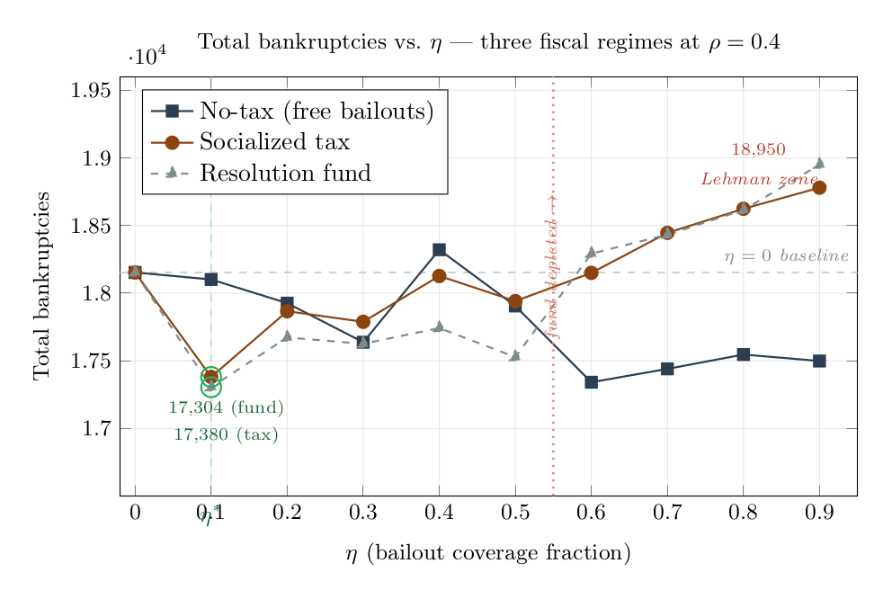
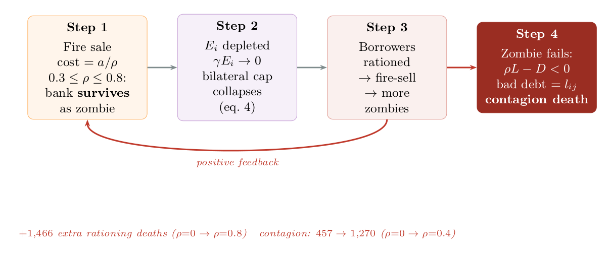
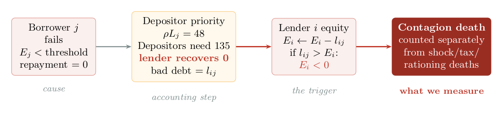
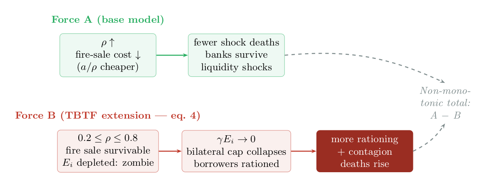

# Too-Big-To-Fail Extension of econo-ml

A **TBTF (Too-Big-To-Fail)** extension of the [`hcastillo/econo-ml`](https://github.com/hcastillo/econo-ml) agent-based interbank network model. 


**Base models:**
- Lenzu & Tedeschi (2012) -- *Systemic risk on different interbank network topologies* (Physica A)
- Berardi & Tedeschi (2017) -- *From banks' strategies to financial (in)stability* (IREF)

---

## What This Extension Does

Bailout expectations distort bank behavior **ex-ante**, creating systemic fragility **endogenously**. When lenders expect that large borrowers will be bailed out, they extend more credit to those borrowers, causing them to absorb disproportionate system liquidity, crowd out smaller borrowers, and create a policy dilemma: the **TBTF trap**.

### The Two Horns of the Trap

- **Horn 1 (no bailout, eta=0):** When the large borrower fails, its lenders absorb massive bad debt. Depositor-priority resolution means lenders recover almost nothing.
- **Horn 2 (bailout, eta>0):** The inflated loan function funnels liquidity toward the TBTF borrower, starving smaller borrowers. The fiscal cost of bailouts further erodes the system.

### The Policy Prediction

There exists an **interior optimum eta\*** where some bailout mitigates catastrophic failure costs, but too much bailout creates an unsustainable liquidity funnel. Confirmed by Monte Carlo (20 seeds): **eta\* ~ 0.1**, optimal band **[0.1, 0.3]**.

---

## Key Equations

The TBTF extension adds four core equations to the pricing and resolution mechanics:

**Bailout probability** (eq. 3) -- larger banks are more likely to be bailed out:
```
b_j = A_{j,t-1} / A_{max,t-1}
```

**Bilateral loan cap** (eq. 6) -- the key distortion, denominator inflates loans for TBTF borrowers:
```
L_ij = min( [gamma*E_i + p_j*(1-b_j)*alpha*A_j] / [p_j*(1 - b_j*eta)] , C_i )
```

**Two-state expected loss** (eq. 4) -- bailout vs. no-bailout states:
```
E(L|d) = (1-b_j)*(L_ij - alpha*A_j) + b_j*(1-eta)*L_ij
```

**Interest rate** (eq. 8) -- zero-profit condition with screening costs:
```
r_ij = [p_j * E(L|d) + kappa] / [(1-p_j) * L_ij]
```

## Key Findings

### Interior Policy Optimum



At rho=0.4, total bankruptcies are minimized at eta ~ 0.1 for both the socialized-tax and resolution-fund regimes. The resolution fund generates worse outcomes at high eta due to fund depletion (the "Lehman mechanism").

### The Zombie Lending Channel



The TBTF bilateral exposure cap (eq. 6) creates an emergent zombie bank channel not present in the base model. Fire-sale survivors persist with depleted equity, collapsing their bilateral caps and rationing borrowers.

### Contagion Propagation



At rho=0.4: liquidation proceeds = 48, depositors claim 135, lender recovers 0. Bad debt equals the full bilateral loan. One-hop propagation only.

### Two Competing Forces



Higher rho reduces shock deaths (Force A) but enables zombie survival that degrades lending capacity (Force B), producing a non-monotonic total.

---

## Three Fiscal Regimes

| Regime | `fiscal_regime` | Description |
|--------|----------------|-------------|
| No fiscal cost | `"none"` | Bailouts are free. Isolates pure moral hazard. |
| Socialized tax | `"socialized_tax"` | End-of-period tax on surviving banks, proportional to assets. |
| Resolution fund | `"resolution_fund"` | Pre-funded levy builds a war chest. Partial bailout if depleted. |

---

## Parameters

### TBTF-specific (new)

| Symbol | Code name | Default | Role |
|--------|-----------|---------|------|
| gamma | `gamma_capital` | 0.08 | IRB capital adequacy fraction (eq. 6) |
| eta | `eta_bailout` | 0.85 | Bailout recovery fraction (policy instrument) |
| alpha | `alpha_collateral` | 0.05 | Collateral recovery for pricing (eqs. 4, 6, 8) |
| -- | `fiscal_regime` | `"socialized_tax"` | Fiscal regime selector |
| tau_fund | `fund_levy_rate` | 0.005 | Resolution fund levy rate |
| -- | `fund_initial_balance` | 0.0 | Starting fund balance |

### Inherited from base model

| Symbol | Code name | Default | Role |
|--------|-----------|---------|------|
| rho | `rho` | 0.4 | Fire-sale recovery rate (resolution) |
| beta | `beta` | 5 | Boltzmann switching intensity |
| mu | `mu` | 0.7 | Deposit shock mean |
| omega | `omega` | 0.6 | Deposit shock dispersion |
| phi | `phi` | 0.025 | BT screening cost (borrower) |
| chi | `chi` | 0.015 | BT screening cost (lender) |
| N | `N` | 50 | Number of banks |
| T | `T` | 1000 | Time periods |

---

## How to Run

### Setup
```bash
git clone https://github.com/frddguzman/econo-bankage.git
cd econo-bankage
python -m venv .venv
source .venv/bin/activate      # Unix
# .venv\Scripts\activate       # Windows
pip install -r requirements.txt
```

### Command line
```bash
# Single simulation
python run_tbtf.py

# Monte Carlo sweep
python run_mc.py

# Parameter sweep (eta)
python sweep_eta.py
```

### Interactive GUIs
```bash
python gui_zombie.py    # Zombie channel dashboard  -> http://127.0.0.1:5003
python gui_sweep.py     # Parameter sweep GUI        -> http://127.0.0.1:5002
python gui_tbtf.py      # General TBTF GUI           -> http://127.0.0.1:5001
```

---

## Project Structure

```
interbank.py                 # Main model (~2500 lines) -- TBTF extension
interbank_lenderchange.py    # Network formation algorithms (Boltzmann, BA, etc.)
interbank_agent.py           # RL agent interface (from base repo)
alternativa.tex              # Mathematical specification of TBTF extension

gui_zombie.py                # Flask backend -- zombie channel dashboard
gui_sweep.py                 # Flask backend -- parameter sweep
gui_tbtf.py                  # Flask backend -- general TBTF
templates/                   # HTML frontends for all three GUIs

sweep_eta.py                 # CLI eta sweep
run_mc.py                    # Monte Carlo runner
run_tbtf.py                  # Single TBTF run
run_ppo.py, run_td3.py       # RL runners (from base repo)
exp_runner*.py                # Experiment framework (from base repo)
experiments/                  # 87 experiment configurations

tests/                        # Test suite
doc/                          # LaTeX documentation + algorithm flowcharts
doc/figures/                  # TikZ source + rendered PNGs
utils/                        # Plotting utilities
models/                       # Pre-trained RL models (from base repo)
```

---

## Detailed Changes

See [`CHANGELOG.md`](CHANGELOG.md) for a complete, equation-by-equation comparison of every modification relative to the upstream codebase.

---

## References

- Lenzu, S. & Tedeschi, G. (2012). Systemic risk on different interbank network topologies. *Physica A*, 391(18), 4331--4341.
- Berardi, S. & Tedeschi, G. (2017). From banks' strategies to financial (in)stability. *International Review of Economics & Finance*, 47, 255--272.
